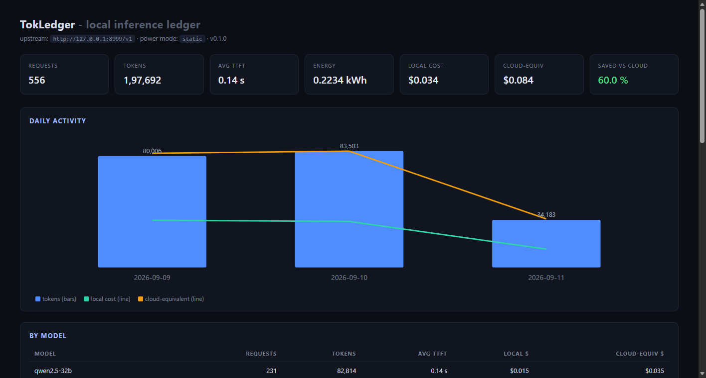
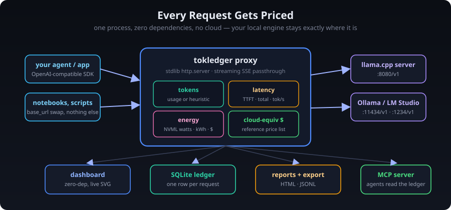

# 📈 TokLedger

**[Quick start](#-quick-start) · [How it works](#-how-it-works) · [MCP](#-mcp) · [Data format](docs/data-format.md) · [Zero dependencies](pyproject.toml)**

[]() []() []() []() []()

The local inference ledger — every token your home GPU serves, priced in tokens, watts, and dollars

<div align="center">
  
</div>

## 💡 The problem this solves

You run a 32B model on your 32 GB rig because API prices hurt. But now **nobody knows what inference actually costs you** — and the tools that try to answer assume a cloud price list, not your electricity bill.

- API observability (Langfuse, Helicone, …) wants your traffic in *their* cloud.
- `ollama ps` tells you VRAM, not cost.
- The "$/token" number people quote is a *cloud* number. Your real cost is **watts × hours × your tariff** — and the comparison that matters is *local $ vs cloud $ for the same tokens*.

TokLedger is a zero-dependency OpenAI-compatible proxy that sits in front of your local engine and writes **one row per request** to a local SQLite ledger:

| You get | From |
| :--- | :--- |
| exact or estimated prompt/completion tokens | engine `usage` (preferred) or a deterministic heuristic |
| TTFT, total latency, tokens/s | measured around the request, streaming-aware |
| energy (kWh) + local $ | NVML GPU power sampling when available, else a configurable draw × your `usd_per_kwh` |
| **cloud-equivalent $** | an editable reference price list (gpt-4o-mini by default) |
| savings % vs cloud | the number to show people who say "why bother running local" |

## 🚀 Quick start

```bash
pip install git+https://github.com/adithyanraj03/TokLedger   # zero runtime deps

# terminal 1: your engine (llama.cpp shown; Ollama/LM Studio/vLLM work too)
./server -m qwen2.5-32b-instruct-q4_K_M.gguf --port 8080

# terminal 2: the ledger (proxy + dashboard on one port)
tokledger serve --port 8081 --upstream http://127.0.0.1:8080/v1
```

Then point any client at the proxy — the *only* change is `base_url`:

```python
from openai import OpenAI
client = OpenAI(base_url="http://127.0.0.1:8081/v1", api_key="none")
r = client.chat.completions.create(model="qwen2.5-32b", messages=[...])  # priced automatically
```

Open <http://127.0.0.1:8081/> — the dashboard is live.

No engine handy? There's a deterministic offline mock so the whole pipeline (streaming, usage parsing, costs) runs with zero models:

```bash
tokledger mock --port 8999 &          # OpenAI-compatible stub
tokledger serve --port 8081 --upstream http://127.0.0.1:8999/v1
curl -s http://127.0.0.1:8081/v1/chat/completions \
  -d '{"model":"mock-7b","messages":[{"role":"user","content":"hello"}]}'
```

## 🖥️ The dashboard

<div align="center">
  
  <sub><b>Live dashboard</b> — 556 requests through the mock provider: tokens, TTFT, kWh, local $ vs cloud-equivalent $, per-model rollup.</sub>
</div>

One HTML file, vanilla JS + inline SVG, no CDN, no framework: stats cards, per-day bars with local-vs-cloud cost lines, per-model table, and the recent-requests feed with a per-row `est` pill whenever token counts are heuristic. Auto-refreshes every 5 s; `GET /export.jsonl` downloads the full ledger.

## ⚙️ How it works

<div align="center">
  
</div>

1. **Proxy** — `POST /v1/chat/completions` is forwarded to your upstream (streaming SSE bytes pass through verbatim).
2. **Measure** — TTFT is time-to-first-byte for streams; tokens come from the engine's `usage` when present (Ollama always, llama.cpp/vLLM with stream usage) else from a deterministic ~4-chars/token heuristic, flagged `est`.
3. **Price** — `kWh = watts × seconds / 3.6e6` (NVML draw if `pynvml` + NVIDIA GPU present, else configured `load_watts`), `local $ = kWh × usd_per_kwh`, `cloud $` from the reference price list.
4. **Record** — one row in `~/.tokledger/ledger.db`; config in `~/.tokledger/config.json` (editable JSON, rate, watts, price list, client tag).

## 🔌 CLI

```
tokledger serve --port 8081 --upstream http://127.0.0.1:8080/v1
tokledger dashboard --port 8090        # API + dashboard, no proxy
tokledger mock --port 8999             # offline OpenAI-compatible provider
tokledger stats                        # totals at a glance
tokledger report -o week.html          # static HTML report
tokledger ingest chatlog.jsonl         # import (TokLedger or minimal OpenAI usage lines)
tokledger export -o all.jsonl          # full ledger out
tokledger mcp                          # MCP stdio server
tokledger config --usd-per-kwh 0.12 --client swarm-planner
```

## 🔌 MCP

`tokledger mcp` speaks MCP over stdio (newline-delimited JSON-RPC, no dependencies) and exposes the ledger to coding agents as four read-only tools — so your agent can answer "what did this week of inference cost?" without you opening a browser:

```jsonc
// mcpServers config (any MCP host)
"tokledger": { "command": "python", "args": ["-m", "tokledger", "mcp"] }
```

| Tool | Returns |
| :--- | :--- |
| `tokledger_stats` | requests, tokens, avg TTFT, kWh, local $, cloud-equiv $, savings % |
| `tokledger_recent` {limit} | latest ledger records |
| `tokledger_model_breakdown` | per-model rollup |
| `tokledger_cloud_savings` | local vs cloud $ + savings |

## 🧪 Development

```bash
pip install pytest
python -m pytest        # 50 tests, no GPU, no network beyond localhost
python examples/seed_demo.py   # 550 deterministic demo requests for screenshots
```

The suite covers token math, cost models, the SQLite ledger, the proxy core with an injected fake upstream (streaming + non-streaming + failures), the mock provider over real sockets, the full end-to-end proxy→ledger path, ingest/export, the MCP protocol in-process *and* over a subprocess, and CLI smoke tests.

## 🤔 Honest scope

- **Token counts** are exact when your engine reports `usage` (recommended: enable it); otherwise they're a clearly-labelled heuristic estimate.
- **Energy attribution** assumes the GPU draw during the request window. Multi-GPU and CPU-side energy are out of scope; NVML covers NVIDIA (AMD/Intel fall back to the configured draw).
- **The cloud price list is a reference**, not a quote — edit `cloud_prices` in `config.json` for your region/provider.
- **Single process, localhost-first**: it's not a multi-tenant gateway; bind it to `127.0.0.1` (the default) and it never needs the internet.

## 🔒 Privacy

No telemetry, no accounts, no cloud, no CDN. One SQLite file, one JSON config, one process on `127.0.0.1`. The mock provider and the full test suite run entirely offline.

## 📄 License

MIT — see [LICENSE](LICENSE).

## 📬 Contact

**Adithya N Raj** · [GitHub](https://github.com/adithyanraj03) · [adithyanraj03@gmail.com](mailto:adithyanraj03@gmail.com) · [LinkedIn](https://www.linkedin.com/in/adithyanraj03)

---

<div align="center">

**© 2026 Adithya N Raj ✨**

</div>
